## Context

Accepted Sprints 1–11 and checked integer arithmetic already deliver the Lean kernel, sequential/parallel/interleaving/atomic operators, finite-participant causal composition, and machine-width arithmetic. CURRENT.json (strategy-audit-20260908) holds 17 lanes; broad implementation dispatch is held. Frozen OpenSpec packages for M4/M5/M6, capability, Claims, corpus, historical reconciliation, honest-gate, Atlas, and unaccepted certificate/liquidity candidates remain historical contracts.

This design sequences remaining work as 37 sprints `P01`–`P37`. It does not accept pending candidates or lift the dispatch hold by itself. Revision `planning-repair-r2-20260908` is a bounded PR1–PR3 planning repair pending independent GPT-6 review; it does not set a review gate accepted. User authorization to execute after that acceptance is recorded separately at `review/semantic-kernel/program-execution-20260908/STATE.json`; do not re-ask. Native Grok 4.6 authors; independent GPT-6 checks. No Foreman. Delivery, if later authorized, is parent-owned to `semantic-kernel-pivot` only. Frozen historical reviews are not rewritten.

Candidate inputs reviewed as unaccepted: `/home/charl/defiformal-wt-certificates-grok-gpt6-20260908/openspec/changes/serialized-kernel-certificates/` and `/home/charl/defiformal-wt-liquidity-grok-gpt6-20260908/openspec/changes/concentrated-liquidity-library/`. Their details may be newer than primary-tree files; this program cites them as planning sources, not accepted gates.

## Goals / Non-Goals

**Goals:**

- Cover every remaining roadmap checkbox (R01–R47), every CURRENT.json lane, residual Atlas/honest-gate items, environment coverage from the 2026-09-06 source plan, and adapter readiness for Moriarty, Compact, ZKIR, and proof-carrying transactions.
- Make one coherent accepted item closable before the rest; allow source readiness independent of M4; require M4→M5→M6 as a true chain; keep Claims and capability off any blanket M4 dependency.
- Demonstrate reusable platform contracts on pinned Uniswap V3 token0 next-price, then a contrasting stateful vault only after an actual pin.
- Keep proof, bounded execution, representation correspondence, source refinement, and external assumptions distinct.
- Preserve original task IDs, dirty trees, negative results, and development-versus-holdout status.

**Non-Goals:**

- Executing any sprint, lifting the strategy dispatch hold, merging to `main`, or archiving existing OpenSpec changes.
- Redoing Sprints 1–11 or checked integer arithmetic.
- Inventing vault, Curve, Morpho, Balancer, margin, insurance, Moriarty, Compact, ZKIR, or PCT semantics where no pin or verified interface exists.
- Reading holdout or assessment payloads.
- Treating this plan as independent acceptance of any frozen implementation candidate.
- Calendar or token estimates.

## Decisions

### D1. Stable program identifiers

Use `P01`–`P37` as the only new sprint IDs. Historical `Sprint12/M4`, `Sprint13/M5`, and `Sprint14/M6` remain legacy mappings on `P01`–`P04`. Original OpenSpec change names and task numbers stay the contracts for those packages.

### D2. Hard dependencies versus recommended order

Hard edges are exactly `sprint-index.json` `dependencies`. Conditional consumed APIs are `conditional_dependencies`. Resource gates are spending policy. Derive diagrams from that index.

True hard dependencies currently:

- `P01 → P02 → P03 → P04` (CURRENT.json includes M6; retain it)
- `P06 → P07`
- `P08 → P09` and `P08 → P10`; `P10` collect 2.4 additionally consumes the `P09` 6.1 development-manifest sub-delivery, not all of `P09`. Original 5.5 splits P09 29-facet records from the P10 challenge record without a `P09` hard edge. Original 7.x/8.x join `P09` and `P10` outcomes without a `P09` hard edge, so there is no task-level cycle. Complete 169-item accounting belongs at that join. `P16` has no corpus closeout barrier.
- `P11 → P12`
- `P15 → P16 → P17` for the reuse experiment; vault source-readiness records may start before `P16`
- `P16 → P18` for the early first-case increment; two-case reuse claim additionally requires `P17`. P18 does not wait on M4 remainder, certificates, or adapters.
- `P19 → P20`; qualified certificate delivery is `P20`, not `P19`
- `P16 → P21` for full concentrated-liquidity traversal (cannot exclude overflow or traversal to close those obligations)
- `P26 → P29`
- `P18 → P33`; `P32` and `P33 → P34`
- `P15 → P31`; PCT implementation additionally consumes `P20`
- `P35 → P36`
- `P37` successful_exit joins `p37_required_terminals` in the index (all required lane terminals). An earlier partial paper does not close P37.

Resource gates, not mathematical prerequisites: `P21`–`P29` wait on `P17.platform_reuse` (one common harness engine executing both cases, named shared financial lemma/contract, named shared executor result, token0 kernel bridge, both adapters, measured case-two inventory). Arithmetic-only `P16`/`P18` reuse does not close that gate. Composition integration, if claimed, requires a meaningful two-operation preservation instance; narrow noncomposing interface/library reuse remains valid. This gate does not depend on `P30`. Certificates are not a prerequisite to the first library experiment. Whole-backlog review is not a prerequisite to `P01`, `P08`, `P13`, `P15`, or `P16` source work.

Recommended first wave: `P01` (default coherent item), independently `P08`, `P11`, `P13`, `P15`, and `P16` source-readiness/oracle repair.

### D3. First library case and contrasting vault

First executable library target is pinned Uniswap v3-core `e3589b192d0be27e100cd0daaf6c97204fdb1899` token0 next-price, including the required denominator-sum overflow branch. That branch cannot be excluded to close `P16`. Repair the Python oracle unbounded-add gap and the M09/F28 control plan before scoring; compiled M09 SwapMath execution remains `P21` with the repaired per-mutant unaffected-control set. Execute Solidity under pinned compiler settings. Python remains a third diagnostic implementation. Liquidity archive SHA-256 is copied from CURRENT.json `liquidity.sha256`. Original 1.2 is independent planning review of the exact repaired P16 token0 slice and P21 residual slice; the unaccepted freeze is preserved input, not accepted evidence, and this revision is not 1.2 acceptance. P16 implementation does not wait on the P21 campaign.

The contrasting case is a stateful vault deposit/withdrawal. No reviewed executable vault pin exists at planning time. `P17` either binds an actual development pin or records `blocked_missing_source`. A second AMM formula is not an allowed substitute.

### D4. Obligation classes and bounded release

A first platform increment may ship as model-proved with bounded source differential evidence and source refinement open. Certificate codec theorems cannot close source refinement. `P30` remains required before `P37` program closure.

### D5. Adapters and environments

Moriarty, Compact, ZKIR, and PCT each have a named readiness task and a distinct named implementation/verification task. Unavailable verified interfaces stay `blocked_unavailable` and keep `P31`/`P37` open; they stay off the `P18` path. PCT that consumes certificates waits on `P20`. Kernel code must not import imagined APIs.

Evaluation environments from the 2026-09-06 source plan (agenda input, not verified evidence): EVM, Solana, Cosmos, Move/Sui, sovereign cross-chain, payment channels. `P32` records pins. `P34` requires actual nonempty success and refusal execution per environment. Unavailable environments keep full evaluation open. EVM token0 evidence does not score other environments. Freeze (`P33`) binds the declared evaluated API/library hashes; later version change invalidates untouched-label reuse.

### D6. File ownership

| Area | Existing or proposed paths |
| --- | --- |
| M4 | existing candidate `lean/DefiKernel/Nary/Tree/` in `/home/charl/defiformal-wt-sprint12-grok-gpt6-20260908`; original tasks in `openspec/changes/operational-tree-regrouping/tasks.md` |
| M5 | proposed `lean/DefiKernel/Extension/` after API refresh; `openspec/changes/operational-active-extension/` |
| M6 | proposed `lean/DefiKernel/AtomicNary/`; `openspec/changes/atomic-metatheory-transfer/` |
| Capability | proposed `lean/DefiKernel/CapabilityProvenance/`; `openspec/changes/capability-provenance-isolation/` |
| Claims | proposed `lean/DefiKernel/Claims/`; cancelled archive under the claims worktree; `openspec/changes/claims-liability-lifecycle/` |
| Corpus | `corpus/adjudicated/v1/`, `scripts/corpus_adjudication/`; `openspec/changes/corpus-provenance-adjudication/` |
| Historical | proposed `lean/DefiHistorical/`; `openspec/changes/historical-claim-reconciliation/` |
| Reporting | `paper/build.sh`, `formal/v3/`, `openspec/changes/honest-gate-failure/` (historical tasks complete; new candidate review in `P13`) |
| Platform contracts | proposed `openspec/changes/reusable-verification-platform-program/contracts/` and later `lean/DefiKernel/Platform/` |
| Liquidity | proposed `lean/DefiKernel/ConcentratedLiquidity/`; unaccepted candidate plan in the liquidity worktree |
| Certificates | proposed `lean/DefiKernel/Certificates/`; unaccepted candidate plan in the certificates worktree |
| Atlas | `viz/`; `openspec/changes/design-atlas-visualization/` |
| Evidence | `review/semantic-kernel/` per-lane directories; proposed `review/semantic-kernel/platform-program/` |
| Program maps | `legacy-task-disposition.json`, `proof-obligation-dependency-matrix.json` |

Paths marked proposed do not exist as accepted APIs.

### D7. Review and mutation protocol

One author, one checker initially. Exact requested/reported model identity. Meaningful nonempty positive and negative inventories. Actual compiled production mutants; timeouts/setup/compile errors are blocked. Proof inventories complete. Changed modules plus affected consumers; exact unchanged-dependency reuse allowed. One review plus targeted rereview default.

### D8. Cleanup

Follow strategy-audit cleanup: no graph-isolation deletion; preserve history and partials; require consumer/root/build/CLI evidence; keep originals recoverable.

## Risks / Trade-offs

- Vault pin never appears → two-case reuse stays open; wider families stay resource-gated; first-case increment can still publish under `P16`/`P18` without a reuse claim.
- M4 recovery fails review → bounded repair; M5/M6 stay blocked; independent lanes continue.
- Liquidity candidate defects (overflow oracle, M09/F28 control plan) are treated as required repairs, not as proof the Uniswap family is impossible. Compiled M09 execution stays with the P21 campaign.
- Adapter systems without verified interfaces remain blocked; that is an honest remainder, not a design hole to fill with invented APIs.
- 37 sprints are planning units, not a calendar. Throughput follows independent acceptance, not empty process slots.
- Unaccepted candidate plans may drift from primary-tree files; implementation must re-bind APIs at each sprint entry.

## Dependency DAG

Hard edges copied from `sprint-index.json`. Resource gates and recommended order are in `sprint-plan.md`. `P18` is reachable from `P16` alone.

```mermaid
flowchart TD
  P01[P01 M4 recovery] --> P02[P02 M4 remainder]
  P02 --> P03[P03 M5]
  P03 --> P04[P04 M6]
  P06[P06 Claims partial] --> P07[P07 Claims full]
  P08[P08 corpus repair] --> P09[P09 identities manifests]
  P08 --> P10[P10 Liquity collector join]
  P09 -.->|6.1 sub-delivery then 7.x/8.x join| P10
  P11[P11 historical repair] --> P12[P12 reconciliation]
  P15[P15 contracts] --> P16[P16 Uniswap token0]
  P16 --> P17[P17 vault reuse]
  P16 --> P18[P18 early increment]
  P16 --> P21[P21 full CL]
  P16 --> P30[P30 refinement]
  P19[P19 checker impl] --> P20[P20 correspondence]
  P26[P26 async] --> P29[P29 cross-domain]
  P18 --> P33[P33 freeze]
  P32[P32 env pins] --> P34[P34 eval]
  P33 --> P34
  P35[P35 Atlas rebind] --> P36[P36 scientific Atlas]
  P15 --> P31[P31 adapters]
  P04 --> P37[P37 full closure]
  P05[P05 capability] --> P37
  P07 --> P37
  P09 --> P37
  P10 --> P37
  P12 --> P37
  P13[P13 reporting R43 R44] --> P37
  P14[P14 residuals] --> P37
  P17 --> P37
  P18 --> P37
  P20 --> P37
  P21 --> P37
  P22[P22 Curve] --> P37
  P23[P23 redemption] --> P37
  P24[P24 Morpho] --> P37
  P25[P25 Balancer] --> P37
  P27[P27 margin] --> P37
  P28[P28 insurance] --> P37
  P29 --> P37
  P30 --> P37
  P31 --> P37
  P34 --> P37
  P36 --> P37
```

